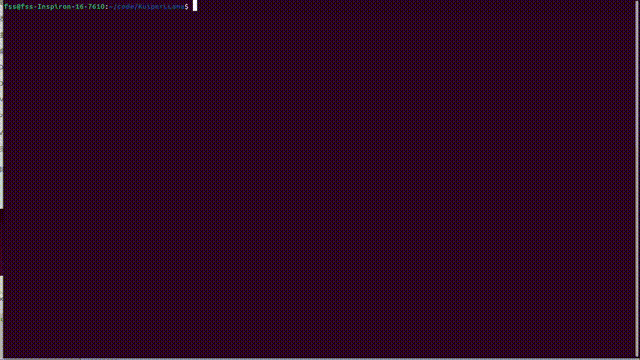

# LLM Inference Engine


## Table of Contents
- [Overview](#overview)
- [Features](#features)
- [Architecture](#architecture)
- [Performance](#performance)
- [Dependencies](#dependencies)
- [Installation](#installation)
- [Usage](#usage)
- [Model Support](#model-support)
- [Advanced Features](#advanced-features)
- [License](#license)

## Overview

LLM Inference Engine is a high-performance, CUDA-accelerated framework for large language model inference. It's designed to efficiently run models like LLaMA and its variants on consumer-grade hardware, focusing on optimized memory usage and rapid text generation.

## Features

- CUDA-accelerated inference for optimal performance on NVIDIA GPUs
- Support for LLaMA and LLaMA2 model architectures
- Int8 quantization for reduced memory footprint
- Efficient KV-cache implementation for faster sequential inference
- Custom CUDA kernels for critical operations (RMSNorm, Softmax, SwiGLU, etc.)
- Memory-mapped weight loading for quick startup and reduced RAM usage
- Modular architecture allowing easy extension to new model types

## Architecture

The engine is built on a modular architecture with the following key components:

1. **Resource Manager**: Handles device memory allocation and tracking
2. **Tensor**: A custom implementation for n-dimensional arrays with GPU support
3. **Operator Registry**: Manages and dispatches computational operators
4. **Model Loader**: Efficiently loads model weights and parameters
5. **Inference Pipeline**: Orchestrates the forward pass through the model
6. **Quantization Module**: Implements int8 quantization for weights and activations

## Performance

On an NVIDIA RTX 3060 Laptop GPU, the engine achieves:

- 60.34 tokens/second for LLaMA 1.1B (FP32)



## Dependencies

- CUDA Toolkit 11.4+
- cuBLAS
- Google glog
- Google Test (for unit tests)
- SentencePiece
- Armadillo (with OpenBLAS backend)

## Installation

1. Clone the repository:
```
git clone https://github.com/AJWZhu/LlamaInfer.git
cd ../LlamaInfer
```

Ubuntu/Debian
```
sudo apt-get install libgoogle-glog-dev libgtest-dev libsentencepiece-dev libopenblas-dev libarmadillo-dev
```

3. Build the project:
```
mkdir build && cd build
cmake ..
make -j$(nproc)
```

## Usage

Run inference on a LLaMA model:

```bash
./llm_infer --model path/to/llama_7b.bin --tokenizer path/to/tokenizer.model --prompt "Once upon a time"
```

## Model Support
Currently supported models:

- LLaMA (7B, 13B, 33B, 65B)
- LLaMA2 (7B, 13B, 70B)
- TinyLLaMA

To use a custom model, export it using the provided script:
```
python export_model.py --model llama2_7b --output llama2_7b.bin --meta-llama path/to/llama/model/7B
```

## Advanced Features
### Quantization
Enable int8 quantization to reduce memory usage:
```
bashCopy./llm_infer --model path/to/llama_7b_int8.bin --quantize int8
```

### Custom CUDA Kernels
The engine implements optimized CUDA kernels for:
- RMSNorm
- Softmax
- SwiGLU activation
- Multi-head attention

These can be found in 
```
src/cuda/kernels/.
```

### Memory-Mapped Model Loading
Large models are loaded using memory mapping, allowing for fast startup times and shared memory across multiple processes.

## License
This project is licensed under the MIT License - see the LICENSE file for details.
